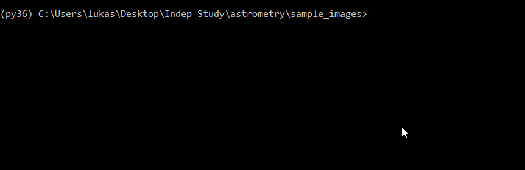
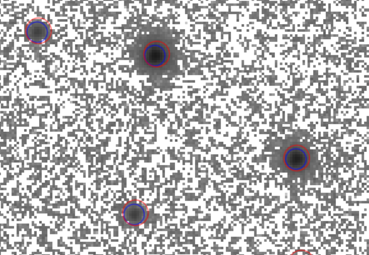
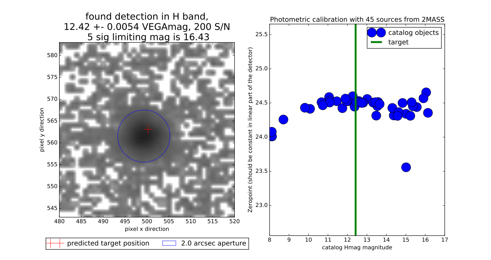

# Astrometry

[](https://zenodo.org/badge/latestdoi/172559215)

A simple python3 tool to quickly correct the rough astrometry given by a telescope for a fits image. For the calibration of the position Panstarrs Dr1, GAIA or 2MASS data can be used. The program considers scaling, rotation, reflection, and translation. To start with it needs a rough position from the fits header or specified as input parameters.

general notes: If already present in the header wcs (World Coordinate System) information is used. If not the wcs is built from scratch. 
The resulting wcs is saved to the fits header and the data is saved as a new file <filename>_astro.fits

Here is a quick example:



The package also includes a quick photometry tool.


## How to install it

### Prerequisites

The program was tested for python 3.6 or newer.
Apart from standard packages, this package needs astroquery, astropy and photutils

```
pip install astroquery astropy photutils pandas
```

Standard packages that are required: matplotlib pandas numpy scipy

### Installing

To use astrometry just clone this repository to your local machine.

```
git clone https://github.com/lukaswenzl/astrometry.git
```

With this, you are all set. If you want to run astrometry from anywhere just install it as a package as follows*

```
pip install -e PATH/TO/CLONED/GITHUB
```

## Changelog

version 1.5 added compatibility with photutils v1.4

version 1.2: now adds header keywords. Does not write the result if the fit failed and has more options. It also tries the fit without considering scaling and general rotations first and goes back in case that fails. Also added the ability to run as a script with import astrometry

## How to use it

Without installing you have to be in the cloned git folder and then you can run

```
python astrometry.py sample_images/sample_file.fits
```

This will perform an astrometric calibration on the sample file. The result will be stored as FILENAME_astro.fits. 
The sample file is one of the sample stars by Legget et al 2006 (doi: 10.1111/j.1365-2966.2006.11069.x): M67-IV-2 taken with the NOT telescope (NOTcam). (Based on observations made with the Nordic Optical Telescope, operated by the Nordic Optical Telescope Scientific Association at the Observatorio del Roque de los Muchachos, La Palma, Spain, of the Instituto de Astrofisica de Canarias. Proposal Number:  59-015, Observers: Irham Andika, Lukas Wenzl, PI: Roberto Decarli)

*If you install the package you can use it anywhere like this:

```
astrometry sample_images/sample_file.fits
```

This installation of the package also takes care of the required packages.


## Further options

Get a list of all options with

```
astrometry --help
```

You can give a list of filenames

```
astrometry sample_images/sample_file.fits sample_images/sample_file.fits
```

Or a directory where each fits file without the addition _astro will be used.

```
astrometry sample_images/
```

If the header is missing a rough position you can directly input the position as follows. Note that ra and dec have to be in degrees

```
astrometry sample_images/sample_file.fits -ra 132.82992  -dec 11.8697
```

If the header is missing the projection you can specify it directly as follows. Note that if None is found it assumes genomic projection (TAN). If this is incorrect the fit will fail. Also, do NOT put the RA---TAN within quotation marks.

```
astrometry sample_images/sample_file.fits -proj1 RA---TAN -proj2 DEC--TAN
```

If the fit fails and the image has low signal to noise or just not many sources it is worth trying to remove the scaling and rotation fit and just determine the offset and do a fine correction:

```
astrometry sample_images/sample_file.fits -rot_scale 0
```

In the same way, the offset determination (-xy_trafo 0) and the fine transformation (-fine 0) can be turned off if so desired.

Lastly, if the image has problems at the borders you can only fit for all sources within a circle. For a circle that touches the sides set to 1 for bigger or smaller circles vary the number.

```
astrometry sample_images/sample_file.fits -vignette 1
```

All of these also work for "python astrometry.py ..." of course.
The full list of parameters can be accessed with astrometry --help

## Example

For the example file the photometry is already pretty good, so the program only performs a slight correction. After the program finishes plots before and after open. Sources detected in the image are marked blue and the catalog objects are projected on with the world coordinates at the start and finish. If the algorithm converged many sources and catalog objects will overlap, less than 5 clearly indicates that the algorithm failed to converge.
Input:


Result:



## Photometry tool

The package also includes a quick tool to perform photometry for a specific source in the image. After astrometry calibration, the position of the targeted object can be used to extract its photometry, calibrated with Pan-STARRS, 2MASS or WISE catalog data. 

[NOTE: It is not advised to use this photometry tool for science! It is meant to get a rough idea about the result. A more careful analysis will likely make better use of the data.]

We can perform astrometry as before. (being in the sample_images folder)
```
astrometry sample_file.fits
```

Then we run 'photometry'. We need to specify the band used and the position of the target. For the band -b is used and the options are g,r,i,z,y,J,H,K and the picture needs to be in the Pan-STARRS or 2MASS footprint respectively. 
The position can be specified via -ra -dec (Note that ra and dec have to be in degrees) or by a name with a csv file called "targets.csv" in the same folder specifying the position (So the csv file needs NAME,RA,DEC columns, where the NAME is a string and RA and DEC are in degrees) 

```
photometry sample_file_astro.fits -b H -ra 132.8320833 -dec 11.8697222
or
photometry sample_file_astro.fits -b H -name AS19
```

The result is a pdf image. It shows a cutout of the target. Above is specified if a 5 sigma source was found or forced photometry was used. Then the magnitude, statistical error, magnitude system and signal to noise are listed. Lastly, the 5 sigma limiting magnitude is given. On the right-hand side, the calibration sources are visualized. Plotted is their magnitude vs calculated zero points. In the linear part of the detector+source catalog, this should be a straight line. The median zero point is used for calibration. With the plot, the systematic error from the calibration can be assessed. For orientation, the brightness of the object is shown as a green vertical line. This pdf is saved as <original_file_name>_raRA_decDEC.pdf 



The literature values is 12.363+-0.01 mag for this source. Therefore the systematics from the calibration have to be considered for the error, but overall the result is consistent with the literature.


## How to Cite
  
 If you find this code usefull for your research, please consider citing it in any resulting publications. Cite as:
  
  Lukas Wenzl. (2022). lukaswenzl/astrometry: Astrometry v1.5 (v1.5). Zenodo. https://doi.org/10.5281/zenodo.6462441

## Author

Lukas Wenzl 
